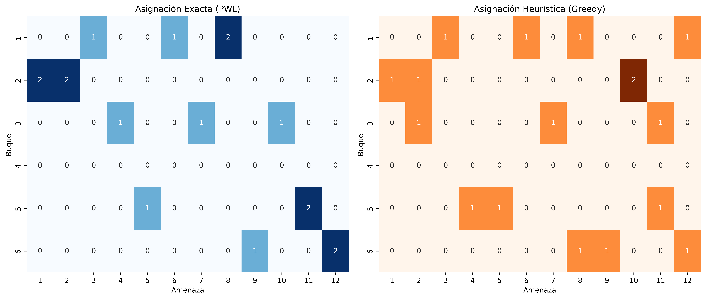

## Eficiencia Computacional vs. Optimalidad en la Asignación de Arma-Blanco para un TEWA

**Autor: Eduardo Carrasco Vidal**, Oficial de Marina, Dirección de Programas, Investigación y Desarrollo de la Armada.

[Acceso al código y extensión del planteamiento matemático en LINK](https://github.com/educarrascov/WTA_TEWA/blob/main/20260630_WTA_MINLP.ipynb)

## A. Weapon–Target Assignment via Piecewise Linearization and CPLEX

---

```python
import math
import random
import time
import pandas as pd
import pulp

def solve_wta_pwl(
    w,         # lista de inventarios w[i] para cada tipo i
    n,         # número de blancos
    K,         # número de tramos PWL
    seed=218   # n° de cadete de la suerte
):
    random.seed(seed)
    m = len(w)

    # 1) Generar aleatoriamente p_{ij}∈[0.5,0.8] y V_j∈[5,10]
    p = [[random.uniform(0.5, 0.8) for j in range(n)] for i in range(m)]
    V = [random.uniform(5, 10)   for j in range(n)]

    # 2) Pre-cálculos
    q     = [[1 - p[i][j] for j in range(n)] for i in range(m)]
    y_min = [sum(w[i]*math.log(q[i][j]) for i in range(m)) for j in range(n)]
    breaks = {
        j: [y_min[j] + k*(0.0 - y_min[j])/K for k in range(K+1)]
        for j in range(n)
    }
    f_vals = {
        j: [V[j]*math.exp(y) for y in breaks[j]]
        for j in range(n)
    }

    # 3) Construir el modelo PWL en PuLP
    model = pulp.LpProblem("WTA_PWL", pulp.LpMinimize)

    # Variables
    x   = pulp.LpVariable.dicts("x",   (range(m), range(n)), lowBound=0, cat="Integer")
    y   = { j: pulp.LpVariable(f"y_{j}", lowBound=y_min[j], upBound=0.0)
            for j in range(n) }
    f_j = { j: pulp.LpVariable(f"f_{j}", lowBound=min(f_vals[j]), upBound=max(f_vals[j]))
            for j in range(n) }
    lam = { (j,k): pulp.LpVariable(f"lam_{j}_{k}", lowBound=0)
            for j in range(n) for k in range(K+1) }

    # 4) Restricciones PWL + enlace
    for j in range(n):
        model += pulp.lpSum(lam[(j,k)] for k in range(K+1)) == 1
        model += y[j]   == pulp.lpSum(breaks[j][k]  * lam[(j,k)] for k in range(K+1))
        model += f_j[j] == pulp.lpSum(f_vals[j][k] * lam[(j,k)] for k in range(K+1))
        model += y[j]   == pulp.lpSum(x[i][j] * math.log(q[i][j]) for i in range(m))

    # 5) Inventario de armas
    for i in range(m):
        model += pulp.lpSum(x[i][j] for j in range(n)) <= w[i]

    # 6) Objetivo
    model += pulp.lpSum(f_j[j] for j in range(n))

    # 7) Resolver con CPLEX (ajusta el path si es necesario)
    start = time.time()
    model.solve(pulp.CPLEX_CMD(
        path="/Applications/CPLEX_Studio_Community2211/cplex/bin/arm64_osx/cplex",
        msg=False
    ))
    status = pulp.LpStatus[model.status]
    print(f"Estado del solver: {status}")
    elapsed_exact = time.time() - start

    # 8) Leer solución
    if status != "Optimal":
        raise RuntimeError(f"CPLEX no encontró solución óptima (estado: {status})")
    sol = [[int(round(pulp.value(x[i][j]))) for j in range(n)] for i in range(m)]
    obj = pulp.value(model.objective)

    return sol, obj, p, V, elapsed_exact

# —————————————— MAIN ——————————————
if __name__ == "__main__":
    # Parámetros que puedes cambiar:
    w = [4, 4, 3, 0, 3, 3]   # inventario de armamento de 6 buques
    n = 12                   # cantidad de amenazas (blancos)
    K = 70                   # cantidad de tramos PWL
    sol, obj, p, V, elapsed_exact = solve_wta_pwl(w, n, K, seed=218)

    print(f"Resultados Algoritmo Exacto - CPLEX (PWL)")
    print(f"Objetivo (suma supervivencia de las amenazas): {obj:.4f}")
    print(f"Tiempo de resolución (exacto): {elapsed_exact:.4f} segundos")
    print("Asignación x[i][j]:")
    for i in range(len(w)):
        for j in range(n):
            if sol[i][j]:
                print(f"  Buque {i} →amenaza {j}: {sol[i][j]} misil(es)")

    # Opcional: imprime p y V para referencia
    print("\np_ij (misil→blanco):")
    for row in p: 
        print(" ", ["{:.2f}".format(v) for v in row])
    print("\nV_j (valor de cada blanco):", ["{:.2f}".format(v) for v in V])

```

    Estado del solver: Optimal
    Resultados Algoritmo Exacto - CPLEX (PWL)
    Objetivo (suma supervivencia de las amenazas): 12.6512
    Tiempo de resolución (exacto): 0.1202 segundos
    Asignación x[i][j]:
      Buque 0 →amenaza 2: 1 misil(es)
      Buque 0 →amenaza 5: 1 misil(es)
      Buque 0 →amenaza 7: 2 misil(es)
      Buque 1 →amenaza 0: 2 misil(es)
      Buque 1 →amenaza 1: 2 misil(es)
      Buque 2 →amenaza 3: 1 misil(es)
      Buque 2 →amenaza 6: 1 misil(es)
      Buque 2 →amenaza 9: 1 misil(es)
      Buque 4 →amenaza 4: 1 misil(es)
      Buque 4 →amenaza 10: 2 misil(es)
      Buque 5 →amenaza 8: 1 misil(es)
      Buque 5 →amenaza 11: 2 misil(es)
    
    p_ij (misil→blanco):
      ['0.59', '0.53', '0.78', '0.60', '0.56', '0.77', '0.51', '0.72', '0.60', '0.56', '0.60', '0.57']
      ['0.69', '0.75', '0.64', '0.56', '0.57', '0.64', '0.54', '0.72', '0.54', '0.64', '0.68', '0.64']
      ['0.58', '0.77', '0.65', '0.76', '0.55', '0.76', '0.79', '0.58', '0.71', '0.74', '0.78', '0.68']
      ['0.67', '0.73', '0.63', '0.52', '0.55', '0.51', '0.54', '0.69', '0.75', '0.61', '0.51', '0.55']
      ['0.55', '0.73', '0.52', '0.61', '0.76', '0.69', '0.64', '0.51', '0.71', '0.55', '0.77', '0.64']
      ['0.65', '0.71', '0.54', '0.66', '0.59', '0.53', '0.56', '0.78', '0.79', '0.61', '0.55', '0.72']
    
    V_j (valor de cada blanco): ['6.10', '8.36', '5.18', '5.02', '5.58', '5.18', '8.87', '9.66', '5.88', '6.68', '8.60', '7.35']

## B. Heurística Greedy para el Problema de Asignación Arma–Blanco (WTA)

---

```python
import math
import random

def solve_wta_greedy(w, n, seed=218):
    random.seed(seed)
    m = len(w)

    # Generar datos aleatorios
    p = [[random.uniform(0.5, 0.8) for j in range(n)] for i in range(m)]
    V = [random.uniform(5, 10) for j in range(n)]

    # Calcular q_{ij}
    q = [[1 - p[i][j] for j in range(n)] for i in range(m)]

    # Inicialización
    x = [[0 for j in range(n)] for i in range(m)]
    remaining = w[:]

    # Estrategia greedy
    start = time.time()
    while True:
        best_delta = float("inf")
        best_i, best_j = None, None

        for i in range(m):
            if remaining[i] == 0:
                continue
            for j in range(n):
                current_yj = sum(x[k][j] * math.log(q[k][j]) for k in range(m))
                current_fj = V[j] * math.exp(current_yj)

                proposed_yj = current_yj + math.log(q[i][j])
                proposed_fj = V[j] * math.exp(proposed_yj)
                delta = proposed_fj - current_fj

                if delta < best_delta:
                    best_delta = delta
                    best_i, best_j = i, j

        if best_i is None:
            break

        x[best_i][best_j] += 1
        remaining[best_i] -= 1

    # Objetivo total
    total_f = 0
    for j in range(n):
        y_j = sum(x[i][j] * math.log(q[i][j]) for i in range(m))
        total_f += V[j] * math.exp(y_j)
    elapsed_greedy = time.time() - start

    # Mostrar resultados
    print(f"Resultados Heurística - (Greedy)")
    print(f"Objetivo (suma supervivencia de las amenazas): {total_f:.4f}")
    print(f"Tiempo de ejecución: {elapsed_greedy:.4f} segundos")
    print("Asignación x[i][j]:")
    for i in range(m):
        for j in range(n):
            if x[i][j] > 0:
                print(f"  Buque {i} →amenaza {j}: {x[i][j]} misil(es)")

    print("\np_ij (misil→blanco):")
    for row in p:
        print(" ", ["{:.2f}".format(v) for v in row])

    print("\nV_j (valor de cada blanco):", ["{:.2f}".format(v) for v in V])

# ——— USO ———
if __name__ == "__main__":
    w = [4, 4, 3, 0, 3, 3]
    n = 12
    solve_wta_greedy(w, n, seed=218)
```

    Resultados Heurística - (Greedy)
    Objetivo (suma supervivencia de las amenazas): 13.8762
    Tiempo de ejecución: 0.0008 segundos
    Asignación x[i][j]:
      Buque 0 →amenaza 2: 1 misil(es)
      Buque 0 →amenaza 5: 1 misil(es)
      Buque 0 →amenaza 7: 1 misil(es)
      Buque 0 →amenaza 11: 1 misil(es)
      Buque 1 →amenaza 0: 1 misil(es)
      Buque 1 →amenaza 1: 1 misil(es)
      Buque 1 →amenaza 9: 2 misil(es)
      Buque 2 →amenaza 1: 1 misil(es)
      Buque 2 →amenaza 6: 1 misil(es)
      Buque 2 →amenaza 10: 1 misil(es)
      Buque 4 →amenaza 3: 1 misil(es)
      Buque 4 →amenaza 4: 1 misil(es)
      Buque 4 →amenaza 10: 1 misil(es)
      Buque 5 →amenaza 7: 1 misil(es)
      Buque 5 →amenaza 8: 1 misil(es)
      Buque 5 →amenaza 11: 1 misil(es)
    
    p_ij (misil→blanco):
      ['0.59', '0.53', '0.78', '0.60', '0.56', '0.77', '0.51', '0.72', '0.60', '0.56', '0.60', '0.57']
      ['0.69', '0.75', '0.64', '0.56', '0.57', '0.64', '0.54', '0.72', '0.54', '0.64', '0.68', '0.64']
      ['0.58', '0.77', '0.65', '0.76', '0.55', '0.76', '0.79', '0.58', '0.71', '0.74', '0.78', '0.68']
      ['0.67', '0.73', '0.63', '0.52', '0.55', '0.51', '0.54', '0.69', '0.75', '0.61', '0.51', '0.55']
      ['0.55', '0.73', '0.52', '0.61', '0.76', '0.69', '0.64', '0.51', '0.71', '0.55', '0.77', '0.64']
      ['0.65', '0.71', '0.54', '0.66', '0.59', '0.53', '0.56', '0.78', '0.79', '0.61', '0.55', '0.72']
    
    V_j (valor de cada blanco): ['6.10', '8.36', '5.18', '5.02', '5.58', '5.18', '8.87', '9.66', '5.88', '6.68', '8.60', '7.35']

## C. Optimality Gap

El **Optimality Gap** es una medida utilizada para evaluar qué tan lejos está una solución heurística (o aproximada) de la solución óptima obtenida por un método exacto. Es especialmente útil cuando se comparan algoritmos como heurísticas (ej. Greedy) frente a modelos exactos resueltos con solvers como CPLEX.

### 1. Fórmula

La brecha de optimalidad se calcula como:

$$
\text{Optimality Gap (\%)} = \frac{Z_{\text{heurístico}} - Z_{\text{óptimo}}}{Z_{\text{óptimo}}} \times 100
$$

Donde:

- $ Z_{\text{óptimo}} $ es el valor de la función objetivo obtenido con el método exacto (benchmark).
- $ Z_{\text{heurístico}} $ es el valor de la función objetivo obtenido con el algoritmo heurístico.

### 2. Interpretación

- **Gap = 0%**: la heurística encontró la solución óptima.
- **Gap > 0%**: la heurística es subóptima; está por encima del óptimo.
- **Gap < 0%**: la heurística supera al modelo exacto (inusual, podría deberse a tolerancia numérica o errores en la formulación del modelo exacto).

```python
import math
import random
import time
import pulp
import pandas as pd

# -----------------------
# GENERADOR DE DATOS
# -----------------------
def generar_datos(m, n, seed=218):
    random.seed(seed)
    p = [[random.uniform(0.5, 0.8) for j in range(n)] for i in range(m)]
    V = [random.uniform(5, 10) for j in range(n)]
    return p, V

# -----------------------
# SOLUCIÓN EXACTA CON PWL
# -----------------------
def solve_wta_pwl(w, p, V, K=70):
    m, n = len(w), len(p[0])
    q = [[1 - p[i][j] for j in range(n)] for i in range(m)]
    y_min = [sum(w[i] * math.log(q[i][j]) for i in range(m)) for j in range(n)]
    breaks = {j: [y_min[j] + k * (0.0 - y_min[j]) / K for k in range(K+1)] for j in range(n)}
    f_vals = {j: [V[j]*math.exp(y) for y in breaks[j]] for j in range(n)}

    model = pulp.LpProblem("WTA_PWL", pulp.LpMinimize)

    x = pulp.LpVariable.dicts("x", (range(m), range(n)), lowBound=0, cat="Integer")
    y = {j: pulp.LpVariable(f"y_{j}", lowBound=y_min[j], upBound=0.0) for j in range(n)}
    f_j = {j: pulp.LpVariable(f"f_{j}", lowBound=min(f_vals[j]), upBound=max(f_vals[j])) for j in range(n)}
    lam = {(j,k): pulp.LpVariable(f"lam_{j}_{k}", lowBound=0) for j in range(n) for k in range(K+1)}

    for j in range(n):
        model += pulp.lpSum(lam[(j,k)] for k in range(K+1)) == 1
        model += y[j] == pulp.lpSum(breaks[j][k] * lam[(j,k)] for k in range(K+1))
        model += f_j[j] == pulp.lpSum(f_vals[j][k] * lam[(j,k)] for k in range(K+1))
        model += y[j] == pulp.lpSum(x[i][j] * math.log(q[i][j]) for i in range(m))

    for i in range(m):
        model += pulp.lpSum(x[i][j] for j in range(n)) <= w[i]

    model += pulp.lpSum(f_j[j] for j in range(n))

    start = time.time()
    model.solve(pulp.CPLEX_CMD(path="/Applications/CPLEX_Studio_Community2211/cplex/bin/arm64_osx/cplex", msg=False))
    elapsed = time.time() - start

    sol = [[int(round(pulp.value(x[i][j]))) for j in range(n)] for i in range(m)]
    obj = pulp.value(model.objective)
    return sol, obj, elapsed

# -----------------------
# SOLUCIÓN GREEDY
# -----------------------
def solve_wta_greedy(w, p, V):
    m, n = len(w), len(p[0])
    q = [[1 - p[i][j] for j in range(n)] for i in range(m)]
    x = [[0 for j in range(n)] for i in range(m)]
    remaining = w[:]
    start = time.time()

    while True:
        best_delta = float("inf")
        best_i, best_j = None, None

        for i in range(m):
            if remaining[i] == 0:
                continue
            for j in range(n):
                current_yj = sum(x[k][j] * math.log(q[k][j]) for k in range(m))
                current_fj = V[j] * math.exp(current_yj)
                proposed_yj = current_yj + math.log(q[i][j])
                proposed_fj = V[j] * math.exp(proposed_yj)
                delta = proposed_fj - current_fj

                if delta < best_delta:
                    best_delta = delta
                    best_i, best_j = i, j

        if best_i is None:
            break
        x[best_i][best_j] += 1
        remaining[best_i] -= 1

    total_f = sum(V[j] * math.exp(sum(x[i][j] * math.log(q[i][j]) for i in range(m))) for j in range(n))
    elapsed = time.time() - start
    return x, total_f, elapsed

# -----------------------
# COMPARACIÓN DE MÉTODOS
# -----------------------
w = [4, 4, 3, 0, 3, 3]
n = 12
p, V = generar_datos(len(w), n, seed=218)

sol_pwl, obj_pwl, t_pwl = solve_wta_pwl(w, p, V)
sol_greedy, obj_greedy, t_greedy = solve_wta_greedy(w, p, V)

gap = 100 * (obj_greedy - obj_pwl) / obj_pwl

# Resultados organizados
resultados = {
    "Método": ["Exacto (PWL)", "Greedy"],
    "Valor objetivo": [obj_pwl, obj_greedy],
    "Tiempo (seg)": [t_pwl, t_greedy],
    "Optimality Gap (%)": [0, gap]
}
df_resultados = pd.DataFrame(resultados)

df_resultados
```

<div>
<style scoped>
    .dataframe tbody tr th:only-of-type {
        vertical-align: middle;
    }

    .dataframe tbody tr th {
        vertical-align: top;
    }

    .dataframe thead th {
        text-align: right;
    }
</style>
<table border="1" class="dataframe">
  <thead>
    <tr style="text-align: right;">
      <th></th>
      <th>Método</th>
      <th>Valor objetivo</th>
      <th>Tiempo (seg)</th>
      <th>Optimality Gap (%)</th>
    </tr>
  </thead>
  <tbody>
    <tr>
      <th>0</th>
      <td>Exacto (PWL)</td>
      <td>12.651231</td>
      <td>0.098126</td>
      <td>0.000000</td>
    </tr>
    <tr>
      <th>1</th>
      <td>Greedy</td>
      <td>13.876191</td>
      <td>0.000531</td>
      <td>9.682533</td>
    </tr>
  </tbody>
</table>
</div>

## D. Asignación gráfica de ambos métodos

Se presenta un mapa de calor que muestra la diferencia entre los resultados obtenidos por el método exacto y el método greedy, rsspecto de la tabla de asignación.

```python
import numpy as np
import seaborn as sns
import matplotlib.pyplot as plt

# Crear matrices de asignación
m = 6   # número de buques
n = 12  # número de amenazas

assign_exact = np.zeros((m, n))
assign_greedy = np.zeros((m, n))

# Rellenar matriz exacta
assign_exact[0][2] = 1
assign_exact[0][5] = 1
assign_exact[0][7] = 2
assign_exact[1][0] = 2
assign_exact[1][1] = 2
assign_exact[2][3] = 1
assign_exact[2][6] = 1
assign_exact[2][9] = 1
assign_exact[4][4] = 1
assign_exact[4][10] = 2
assign_exact[5][8] = 1
assign_exact[5][11] = 2

# Rellenar matriz greedy
assign_greedy[0][2] = 1
assign_greedy[0][5] = 1
assign_greedy[0][7] = 1
assign_greedy[0][11] = 1
assign_greedy[1][0] = 1
assign_greedy[1][1] = 1
assign_greedy[1][9] = 2
assign_greedy[2][1] = 1
assign_greedy[2][6] = 1
assign_greedy[2][10] = 1
assign_greedy[4][3] = 1
assign_greedy[4][4] = 1
assign_greedy[4][10] = 1
assign_greedy[5][7] = 1
assign_greedy[5][8] = 1
assign_greedy[5][11] = 1

# Graficar ambos heatmaps
fig, axs = plt.subplots(1, 2, figsize=(14, 6))

# Exacto
sns.heatmap(assign_exact, annot=True, fmt=".0f", cmap="Blues", ax=axs[0], cbar=False)
axs[0].set_title("Asignación Exacta (PWL)")
axs[0].set_xlabel("Amenaza")
axs[0].set_ylabel("Buque")
axs[0].set_xticks(np.arange(n) + 0.5)
axs[0].set_xticklabels([f"{j+1}" for j in range(n)])
axs[0].set_yticks(np.arange(m) + 0.5)
axs[0].set_yticklabels([f"{i+1}" for i in range(m)])

# Greedy
sns.heatmap(assign_greedy, annot=True, fmt=".0f", cmap="Oranges", ax=axs[1], cbar=False)
axs[1].set_title("Asignación Heurística (Greedy)")
axs[1].set_xlabel("Amenaza")
axs[1].set_ylabel("Buque")
axs[1].set_xticks(np.arange(n) + 0.5)
axs[1].set_xticklabels([f"{j+1}" for j in range(n)])
axs[1].set_yticks(np.arange(m) + 0.5)
axs[1].set_yticklabels([f"{i+1}" for i in range(m)])

plt.tight_layout()

# Guardar con alta resolución (600 dpi para revista)
#plt.savefig("asignacion_comparativa.png", dpi=600, bbox_inches='tight')

plt.show()

```


